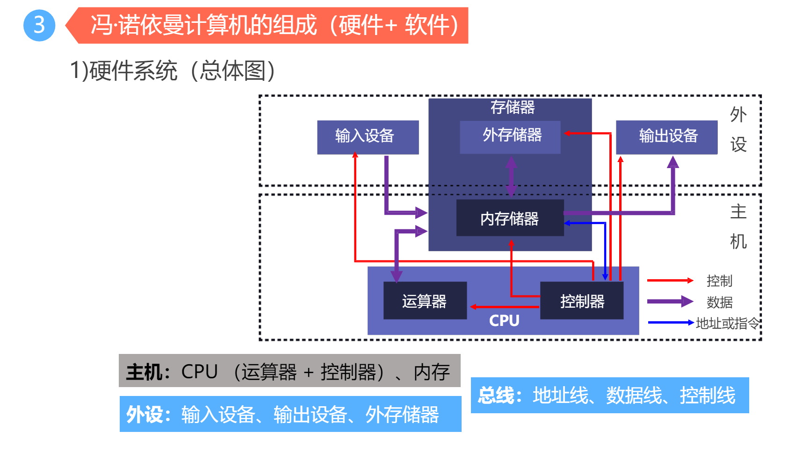
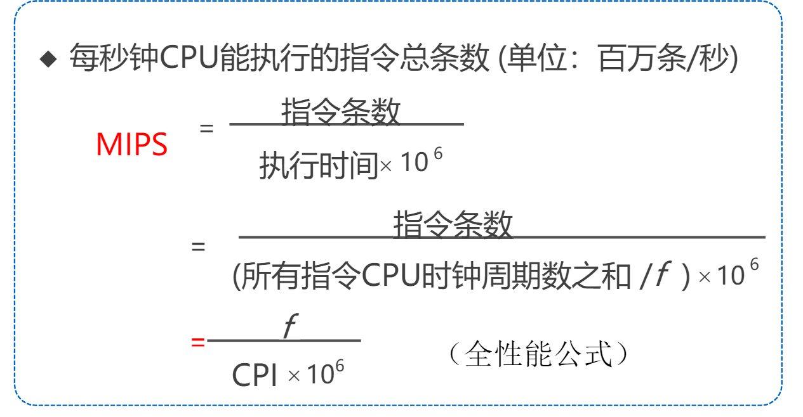
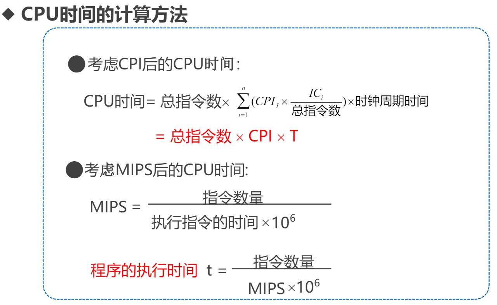
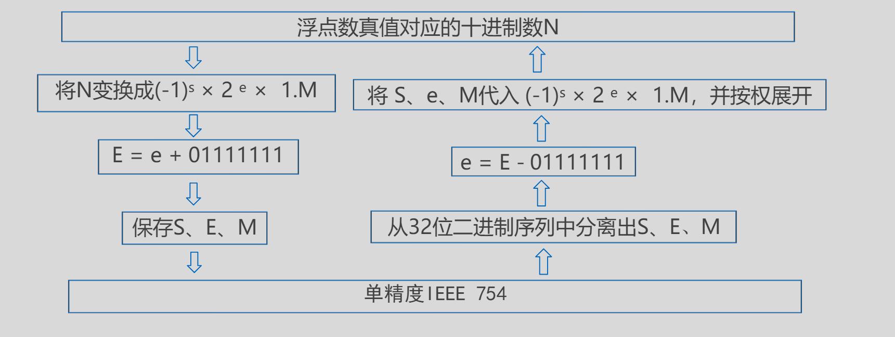
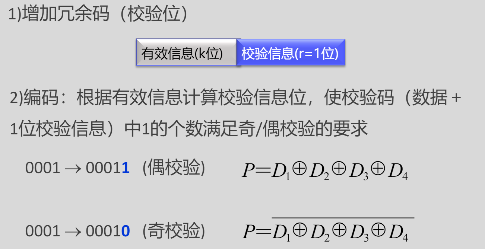
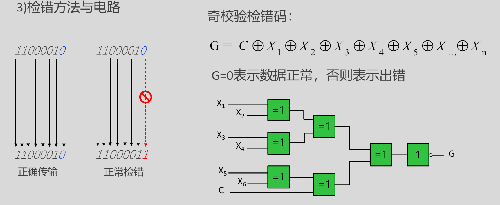
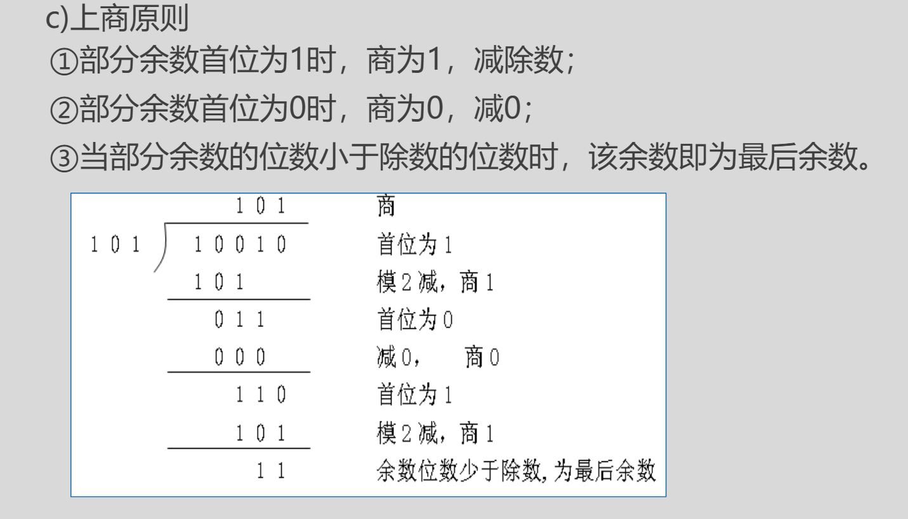
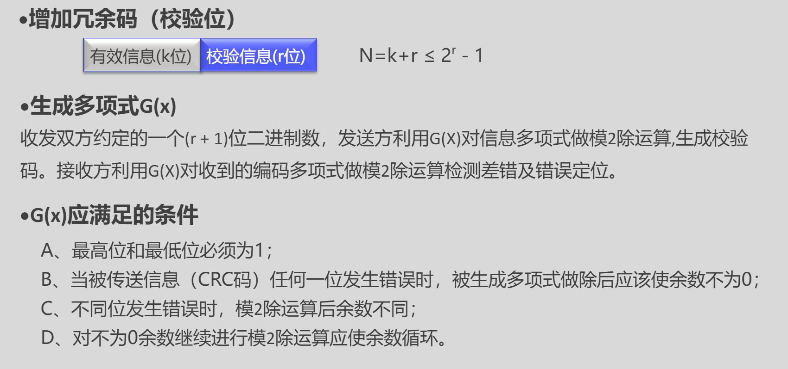

### 第一章
#### 计算机系统性能评价
##### 非时间指标
1) 机器字长: 指机器一次能处理的二进制位数
2) 总线宽度：数据总线一次能并行传送的最大信息的位数
3) 主存容量与存储带宽
&emsp;主存容量：是指一台计算机主存所包含的存储单元总数。
&emsp;存储带宽： 指单位时间内与主存交换的二进制信息量，
常用单位B/s（字节/秒）。(影响存储带宽的指标包括数
据位宽和数据传输速率)。

##### 时间指标
1) 主频f/时钟周期T
T×f=1
主频 = 外频 × 倍频
如：Pentium 4 2.4G CPU主频
2400M = 133M (外频) × 18 (倍频)
2) CPI (Clock cycles Per Instruction)
执行一条指令平均需要的时钟周期（T）数
CPI = 程序中所有指令的时钟周期数之和/程序指令总数
&emsp;&emsp;= Σ(程序中各类指令的CPI ×程序中该类指令的比例)
CPU性能判断标准应该是：CPU性能=IPC(CPU每一时钟周期内所执行的指令多少)×频率(MHz时钟速度)
CPI×IPC=1
3) MIPS (Million Instructions Per Second)

4) CPU时间
CPU时间 = 程序中所有指令的时钟周期数之和 × T

### 第二章
#### 机器内数据表示
1) 真值：符号用 “+” 、
“ - ” 表示的数据表示方法。
2) 机器数：符号数值化的数据表示方法, 用0、1表示符号。
3) 原码
符号位加上真值的绝对值, 即用第一位表示符号, 其余位表示值. 比如如果是8位二进制:
[+1]原 = 0000 0001
[-1]原 = 1000 0001
4) 反码
正数的反码是其本身
负数的反码是在其原码的基础上, 符号位不变，其余各个位取反.
[+1] = [00000001]原 = [00000001]反
[-1] = [10000001]原 = [11111110]反
5) 补码
正数的补码就是其本身
负数的补码是在其原码的基础上, 符号位不变, 其余各位取反, 最后+1. (即在反码的基础上+1)
[+1] = [00000001]原 = [00000001]反 = [00000001]补
[-1] = [10000001]原 = [11111110]反 = [11111111]补
6) 定点数
小数点位置固定的点数
X0.X1X2X3X4……..Xn
表示范围小
7) 浮点数
N=M×BE
B为基数，也就是几进制基数就是几
IEEE 754格式浮点数

||  |  |   |
|----|----| ---- | ---- |
|S|8位E | 23位M | 单精度 |
|S|11位E | 52位M | 双精度 |

#### 数据校验
码距≥e+1:可检测e个错误
码距≥2t+1:可纠正t个错误
码距≥e+t+1:可纠正t个错误，同时检测e个错误(e≥t)
1) 奇偶校验

不能检测偶数位错误, 无错结论不可靠，是一种错误检测码
不能定位错误，因此不具备纠错能力
#### CRC校验

模二运算规则：0±0＝0，0±1＝1，1±0＝1，1±1＝0
模二除运算

#### 海明
